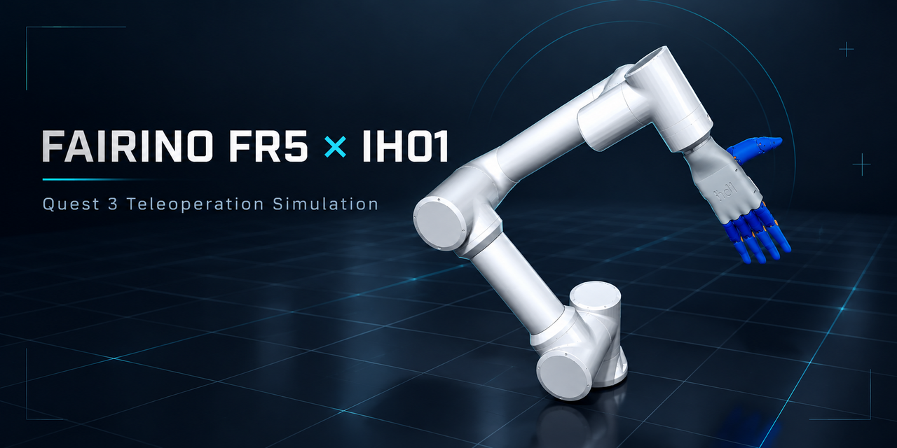

# FAIRINO FR5 + Quest 3 + IH01 Teleoperation

[中文说明](README_CN.md)



This repository is a portable, safety-gated integration of a FAIRINO FR5 arm,
an IH01 dexterous hand, and Meta Quest 3 hand tracking. The bundled
`IPE-quest-hand-teleop/` directory contains the Quest receiver, IH01 model,
and EtherCAT path; no sibling checkout is required at runtime.

The default path is simulation-only. Real FR5 output is not enabled by these
commands, and IH01 hardware remains disarmed until the operator explicitly
arms it.

## Quick start

```bash
make setup       # once: create the local virtual environment
make check       # hardware-free validation
make arm-sim     # manual FR5 + IH01 MuJoCo viewer
make arm-teleop  # Quest-linked simulation and control panel
```

Start the Quest application manually and select `TCP Wired / localhost / 8000`.
`make arm-teleop` checks ADB and creates the reverse tunnel; it does not launch,
close, or mirror the Quest activity. Select right, left, or both hands in the
prompt or in the panel. Press `E` to start, press `E` again to pause/resume, and
press `Space` to return to the authored Ready pose
(`[-0.0305, -0.929, -1.61, -1.54, 1.56, 0]` rad) and disarm. `Esc` and the
red E-stop latch stop the local session.

## Canonical commands

```text
make setup         install local dependencies
make check         run portability, model, compile, test, and headless checks
make arm-sim       manual simulation; no Quest or hardware required
make arm-teleop    Quest wrist/hand mapping to the combined simulation
make hand-teleop   Quest mapping with optional physical IH01 output
make ui            graphical launcher and live telemetry
make hand-control  preserved IH01 manual-control dashboard
```

`make arm-sim` starts in a stable manual mode. `q/a`, `w/s`, `e/d`, `r/f`,
`t/g`, and `y/h` jog FR5 J1–J6; `0` returns to Ready and `o/c` opens/closes the
hand. The viewer includes a floor, two narrow square bottles, a yellow box,
MuJoCo contacts, and a fixed lower-right palm-camera picture-in-picture. The
panel can move a selected prop by 20 mm on X/Y/Z. `arm-sim` hides the props when
the goal is only to inspect arm joints.

The Quest mapper uses a wrist-anchor Cartesian target, orientation signs,
translation/rotation slew limits, and a bounded workspace. The target is the
mounted IH01 palm-center TCP, not a copied human shoulder or elbow angle. Tune
`config/teleop.yaml` only after checking one axis at a time; the default arm
translation scale is 1.60 and the default translation speed is 220 mm/s.

`make hand-teleop` always starts with simulation visible and keeps output
disarmed. Pressing `E` requests physical IH01 output; if no valid EtherCAT hand
is detected, the UI reports the reason and remains in simulation. The separate
`make hand-control` command is retained for direct IH01 manual control. IH01
contact protection holds a channel when current reaches 1000 mA or a stall lasts
200 ms, and releases when the target is backed off; thumb-index soft coupling is
not used.

## Quest 3 installation

Enable Developer Mode in the Meta Horizon mobile app, connect and unlock the
headset, and accept USB debugging. From the bundled project:

```bash
cd IPE-quest-hand-teleop
make status      # must report an authorized device
make install     # install hand_tracking_streamer.apk
make reverse     # forward Quest localhost:8000 to the PC
```

`make reverse` never installs an APK. The current Unity package is
`com.haoming.ipe.handteleop`; `make unity-build` requires Unity 6 and only
builds the APK. After rebuilding, run `make install` explicitly. To replace an
already installed APK use `FORCE_INSTALL=1 make install`; this may restart a
running activity. In the Quest app library choose **Unknown Sources** if the
application is not shown.

## Layout and boundaries

```text
src/fairino_fr5_vr/    protocol, mapping, safety gate, runtime, adapters
config/teleop.yaml     portable Quest/FR5/IH01 mapping and limits
scripts/               launchers, UI, model generation, and FR5 diagnostics
simulation/            generated combined MuJoCo model and resolved config
docs/                  architecture, operation, provenance, and audit notes
tests/                 hardware-free regression tests
third_party/           FAIRINO SDK with its upstream license
IPE-quest-hand-teleop/ Quest/IH01 integration component
```

`make check` runs `scripts/check_portability.py`, which rejects external local
paths, external symlinks, or missing bundled runtime dependencies. The MuJoCo
collision and penetration checks are simulation safeguards only; they are not a
certified FR5 safety function. Read [docs/OPERATIONS.md](docs/OPERATIONS.md)
before connecting hardware and keep the physical E-stop accessible.

See [docs/ARCHITECTURE.md](docs/ARCHITECTURE.md) for data flow and
[docs/PROVENANCE.md](docs/PROVENANCE.md) for upstream/license boundaries.
